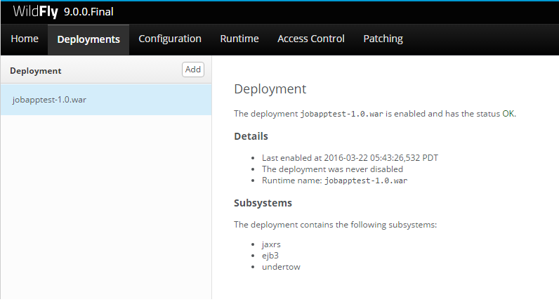

# BlueMedia-Job-App-Test
##Implementacja
### Architektura
Dwie klasy - modele Wnisoku (App) oraz log zmian dla danego wniosku (StateLog)
Relacja jeden do wielu App -> StateLogs
AppManager - Jeden Kontroller  do zarzadzania encjami.
Applications - odpowiedzialny z REST endopinty
AppDocument/UriMApper/ResourceMapper - sluzy do mapowania obiektow App w obie strony
### Komponenty
Serwer Web - Jboss/WildFly
BazaDanych - Hibernate + MongoDB
## Status Wykonania
### Pierwsza Faza (Alpha)
Gole:
- [x] Encje w bazie danych
- [x] Mozliwy odczyt/zapis
- [x] Testy

```
-------------------------------------------------------
 T E S T S
-------------------------------------------------------
Running com.bluemedia.jobapptest.AppManagerTest
[...]
INFO: HHH000204: Processing PersistenceUnitInfo [
	name: AppPu
	...]
Mar 22, 2016 5:53:38 AM org.hibernate.Version logVersion
printHistory
[..]
Mar 22, 2016 5:53:47 AM org.hibernate.jpa.internal.EntityManagerFactoryRegistry addEntityManagerFactory
WARN: HHH000436: Entity manager factory name (AppPu) is already registered.  If entity manager will be clustered or passivated, specify a unique value for property 'hibernate.ejb.entitymanager_factory_name'
+----------------------------------+----------------------------------+------------------------+
|               Name               |             Date                 |         State          |
+----------------------------------+----------------------------------+------------------------+
| TEST Name                        | Sat Mar 19 20:58:59 PDT 2016     | CREATED                |
+----------------------------------+----------------------------------+------------------------+
Mar 22, 2016 5:53:47 AM org.hibernate.ogm.datastore.mongodb.impl.MongoDBDatastoreProvider stop
INFO: OGM001202: Closing connection to MongoDB
[...]
createApp
Mar 22, 2016 5:53:47 AM org.hibernate.ejb.HibernatePersistence logDeprecation
Size: 10
+----------------------------------+----------------------------------+------------------------+
|               Name               |             Content              |         State          |
+----------------------------------+----------------------------------+------------------------+
| TEST Name                        | TEST Content                     | CREATED                |
| TEST Name                        | TEST Content                     | CREATED                |
| TEST Name                        | TEST Content                     | CREATED                |
| TEST Name                        | TEST Content                     | CREATED                |
| TEST Name                        | TEST Content                     | CREATED                |
| TEST Name                        | TEST Content                     | CREATED                |
| TEST Name                        | TEST Content                     | CREATED                |
| TEST Name                        | TEST Content                     | CREATED                |
| TEST Name                        | TEST Content                     | CREATED                |
| TEST Name                        | TEST Content                     | CREATED                |
+----------------------------------+----------------------------------+------------------------+
Mar 22, 2016 5:53:48 AM org.hibernate.ogm.datastore.mongodb.impl.MongoDBDatastoreProvider stop
INFO: OGM001202: Closing connection to MongoDB
```
Podczas testow pojawil sie problem:
https://forum.hibernate.org/viewtopic.php?f=31&t=1039494

### Faza druga (Beta)
Gole 
- [x] Przejscie na WAR 
- [x] Dodanie REST
- [x] Deploy na WilFly
- [ ] Testy

Napotkane problemy z dependecy:
![Dependenc Error] (AbstractMethodError.png)

Wymagaly sporo czasu na znaleznie przyczyny, oraz naprawe. Niestety opoznily deploy.



Udalo sie przejsc do testow manualnych i pojawil sie problem z pobieraniem encji z bazy (dzialalo w poprzedniej fazie)

![Null Objects] (Deployed_Null_Obj.png)
![Null_JSON] (Working_jobapp_no_objects.png)

Lista obiektow (ilosc po getResult) sie zgadza, mapowanie "dziala".
Nie udalo sie jeszcze zdiagnozowac przyczyny, co zablokowalo dalsza implementacje.


